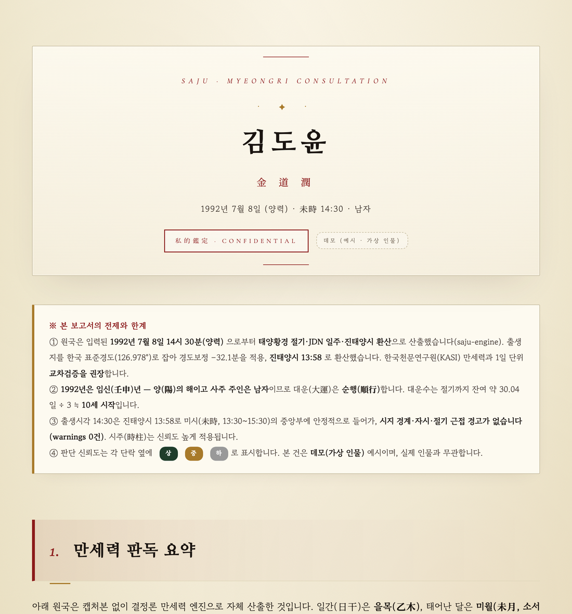

<div align="center">

# 🔮 saju-engine

**양력 생년월일시·성별만으로 30년 역술가 수준의 사주(四柱)·궁합 보고서를 단청(丹靑) HTML로 만들어 주는 Claude Code 플러그인**

*A deterministic Korean Four-Pillars (Saju / 四柱) report generator for Claude Code — calculation engine + MCP server + diviner persona skill.*

[](LICENSE)
[](https://nodejs.org)


[](CONTRIBUTING.md)



</div>

Claude Code 채팅에 `홍길동 2000.03.21 12:00 남자 사주 봐줘` 한 줄이면 끝.
**만세력 계산은 결정론 엔진(코드)이** 정확히 하고, **해석은 역술가 페르소나(LLM)가** 깊이 있게 얹어 `~/Desktop`에 12단계 보고서 HTML을 생성합니다. 두 사람을 주면 **궁합(연애·결혼) 보고서**도 만듭니다.

---

## 목차

- [✨ 특징](#-특징)
- [🚀 빠른 시작](#-빠른-시작)
- [📦 설치](#-설치)
- [💬 사용법](#-사용법)
- [⚙️ 작동 원리](#️-작동-원리)
- [🧰 MCP 툴](#-mcp-툴)
- [🛠️ 개발 & 테스트](#️-개발--테스트)
- [🤝 기여](#-기여)
- [🗺️ 로드맵 & 한계](#️-로드맵--한계)
- [📜 라이선스 & 고지](#-라이선스--고지)

---

## ✨ 특징

- 📜 **개인 사주 보고서** — 12단계(원국·평생총운·금전·직업·연애·결혼·건강·인간관계·대운·세운·총평)
- 💞 **궁합 보고서** — 10단계(일간관계·오행상보·용신교환·일지합충·결혼적기·종합점수)
- 🎨 **단청(丹靑) 디자인** — 한지 질감 배경, 4기둥 표, 오행 막대, 대운 표, 인쇄/모바일 대응
- 🧮 **결정론 만세력** — 절기(태양황경)·일주(JDN)·진태양시·대운을 천문 계산으로 산출 → 손계산 오차 제거
- 🗣️ **쉬운 풀이** — 모든 전문용어를 "쉽게 말하면…"으로 실생활 번역, 신뢰도(상/중/하) 표기
- 🔌 **무설치(zero-dependency)** — Node 18+ 만 있으면 됨. MCP 서버 + skill 로 Claude Code 에 바로 연결

> 👀 **출력 예시**: [`examples/sample-individual-report.html`](examples/sample-individual-report.html) 을 브라우저로 열어 보세요 (가상 인물 데모).

---

## 🚀 빠른 시작

```bash
git clone https://github.com/adminhelper/saju-engine.git
cd saju-engine

# (선택) 잘 도는지 확인 — 설치 불필요, Node 18+ 만 있으면 됨
node test/validate.mjs     # 골든 회귀 테스트
node test/smoke-mcp.mjs    # MCP 서버 구동 테스트
```

그다음 아래 **설치 (A) 또는 (B)** 로 Claude Code 에 연결하면 채팅에서 바로 쓸 수 있습니다.

---

## 📦 설치

> 요구사항: **Node.js ≥ 18** · 외부 의존성 없음(`npm install` 불필요)

### (A) Claude Code 플러그인으로 — 권장

skill(`/saju`)과 MCP 서버가 함께 활성화됩니다. 플러그인으로 등록하면 `.mcp.json` 의 `${CLAUDE_PLUGIN_ROOT}` 가 설치 경로로 자동 치환됩니다.

```jsonc
// .mcp.json (저장소에 포함 — 플러그인이 자동 인식)
{
  "mcpServers": {
    "saju-engine": { "command": "node", "args": ["${CLAUDE_PLUGIN_ROOT}/mcp/server.mjs"] }
  }
}
```

### (B) MCP 서버만 단독 등록

`/saju` skill 없이 `compute_saju` / `compute_gunghap` 툴만 쓰려면 **절대경로**로 등록합니다.

```bash
claude mcp add saju-engine -s user -- node /절대경로/saju-engine/mcp/server.mjs
```

또는 `~/.claude/settings.json` (또는 프로젝트 `.mcp.json`)에 직접:

```json
{
  "mcpServers": {
    "saju-engine": { "command": "node", "args": ["/절대경로/saju-engine/mcp/server.mjs"] }
  }
}
```

> 새 MCP 서버는 **Claude Code 재시작 후** 세션에 반영됩니다.

---

## 💬 사용법

채팅에 자연어로 던지면 `/saju` skill 이 발동합니다.

```text
# 개인 사주
홍길동 洪吉童 2000.03.21 12:00 남자 양력 사주 봐줘

# 궁합 (두 사람 + "궁합")
A 1995.05.20 09:00 남자 / B 1996.08.11 14:30 여자 궁합 봐줘
```

대충 줘도 알아서 파싱하고, **확인 카드**(4기둥·신강약·대운·경고)로 한 번 되물어본 뒤 생성합니다 — 잘못된 입력으로 인한 재생성을 막기 위함입니다.

| 항목 | 예 | 비고 |
|---|---|---|
| 이름 / 한자 | 홍길동 / 洪吉童 | 한자는 선택(디자인용) |
| 생년월일 | 2000-03-21 | **양력** 권장 |
| 출생시각 | 12:00 | 모르면 시주 제외 |
| **성별** | 남자 / 여자 | **필수** — 대운 방향이 갈림 |
| 양/음력 | 양력 | 음력은 양력으로 변환 후 |

결과는 채팅에 나열하지 않고 **`~/Desktop/saju-<이름>-<연도>.html`** 파일로 저장됩니다.

---

## ⚙️ 작동 원리

```
사용자 입력  →  결정론 만세력 엔진  →  MCP 서버  →  /saju skill        →  단청 HTML 템플릿  →  ~/Desktop/*.html
                (mcp/lib/*.mjs)       (compute_saju /   (역술가 통변·          (individual /
                 절기·JDN·진태양시·      compute_gunghap)   용신확정·신뢰도)        gunghap.html)
                 대운을 코드로 산출)
```

- **엔진은 구조적 "사실"만** 결정론적으로 계산 — 4기둥 간지, 십성, 지장간, 12운성, 신살, 공망, 합충형파해, 신강·신약 점수, 용신 후보, 대운(방향·시작나이·배열).
- **해석/통변은 LLM(skill)** 의 몫 — 용신 확정, 신강신약 보정, 신뢰도(상/중/하), 경계 모호성 명시.

| 경로 | 역할 |
|---|---|
| `mcp/lib/*.mjs` | 결정론 만세력 엔진 (`constants`·`astronomy`·`core`·`pillars`·`elements`·`daewoon`·`saju`) |
| `mcp/server.mjs` | 무설치 stdio JSON-RPC MCP 서버 (`compute_saju`, `compute_gunghap`) |
| `skills/saju/SKILL.md` | 역술가 페르소나 · 12단계 구조 · 통변 규칙 · 입력 확인 게이트 |
| `templates/*.html` | 단청 HTML 템플릿 (개인 12섹션 / 궁합 10섹션) |
| `test/*.mjs` | 골든 회귀 · MCP 스모크 테스트 |
| `examples/` | 출력 예시(가상 인물) |

---

## 🧰 MCP 툴

### `compute_saju` — 개인 1명 원국

| 필드 | 타입 | 필수 | 설명 |
|---|---|:---:|---|
| `gender` | `"male"`\|`"female"` | ✔ | **대운 방향 결정** |
| `year` `month` `day` `hour` | integer | ✔ | 양력 생년월일 + 24시간제 시 |
| `minute` | integer | | 분 (기본 0) |
| `name` | string | | 이름(선택) |
| `longitude` | number | | 진태양시 보정 경도 (기본 서울 126.978) |
| `saeunFrom` `saeunTo` | integer | | 세운 계산 연도 범위(선택) |

반환: `원국`(간지·십성·지장간·12운성), `오행분포`, `신강신약`, `용신후보`, `신살`, `공망`, `합충형파해`, `대운`, `세운`, `warnings`.

### `compute_gunghap` — 두 사람 궁합

`personA`, `personB` 각각 위 `compute_saju` 인자와 동일. 반환: `일간관계`, `일지관계`, `오행상호보완`, `십성교차`, `종합점수`, 각자의 전체 원국.

---

## 🛠️ 개발 & 테스트

zero-dependency라 클론 후 바로 실행됩니다.

```bash
node test/validate.mjs    # 골든 회귀: 합성 케이스의 4기둥·대운방향·시지경계경고 고정값 대조
node test/smoke-mcp.mjs   # MCP: stdio 핸드셰이크 + 두 툴 호출 end-to-end
```

- `test/validate.mjs` 의 케이스는 **검증된 엔진 출력을 고정한 골든값**(실제 인물 아닌 합성 날짜)으로, 계산 로직을 수정했을 때 회귀를 잡아냅니다.
- 엔진을 라이브러리로 직접 호출할 수도 있습니다:

```js
import { computeSaju, computeGunghap } from "./mcp/lib/saju.mjs";
const r = computeSaju({ gender: "male", year: 2000, month: 3, day: 21, hour: 12, minute: 0 });
```

---

## 🤝 기여

PR 환영합니다. 디자인·페르소나·계산 로직을 어디서 어떻게 고치는지는 **[UPDATE.md](UPDATE.md)** 에 "파일 지도 + 변경 레시피 + 검증 루틴"으로 정리돼 있습니다. 자세한 절차는 **[CONTRIBUTING.md](CONTRIBUTING.md)** 참고.

요약: 변경 → `node test/validate.mjs && node test/smoke-mcp.mjs` 통과 → PR.

---

## 🗺️ 로드맵 & 한계

**한계**
- **양력만 정밀 지원** — 음력은 먼저 양력으로 변환해 입력(변환 근거는 보고서에 명시).
- **신살·용신은 휴리스틱** — 엔진은 후보만, 최종 통변은 LLM(역술가 skill)이 확정.
- **진태양시 기본 경도는 서울(126.978°)** — 출생지가 다르면 `longitude` 로 보정.
- 정밀도가 중요하면 **KASI(한국천문연구원) 만세력과 1일 교차검증** 권장.

**로드맵**
- [ ] 음력 → 양력 네이티브 변환 모듈 (`mcp/lib/lunar.mjs`)
- [ ] 신살 테이블 확장 (귀문관살·원진·천라지망 등)
- [ ] 격국 자동 판별 보강
- [ ] 영어 보고서 템플릿 / i18n

---

## 📜 라이선스 & 고지

- **[MIT](LICENSE)**
- 본 소프트웨어가 생성하는 사주/궁합 보고서는 **명리학적 해석**이며, 의료·법률·재무·심리 등의 전문 자문을 대체하지 않습니다.
